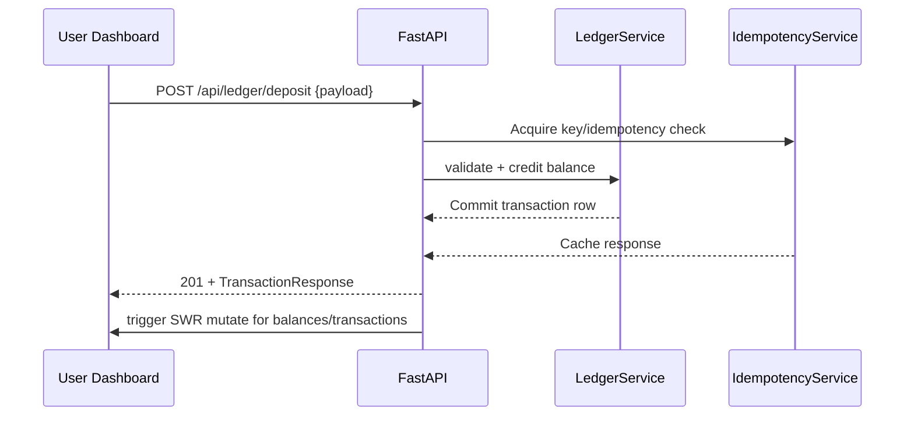
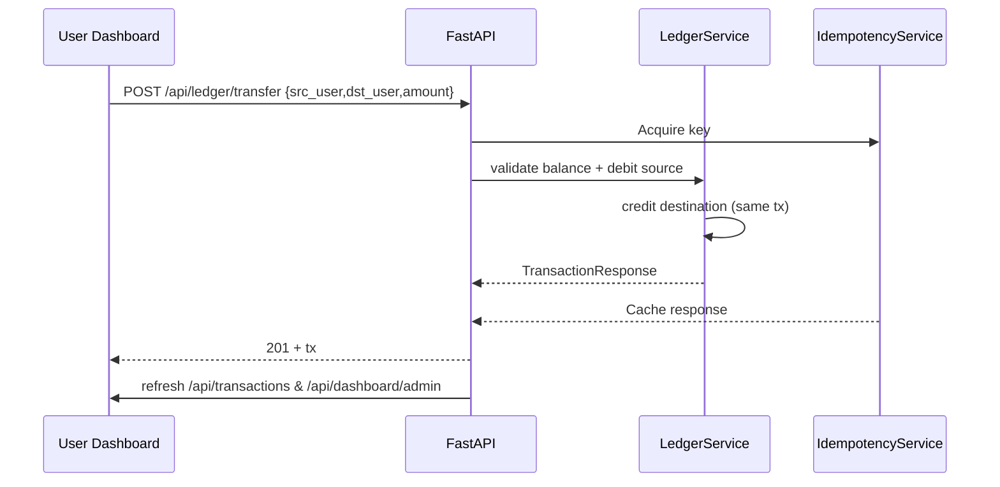
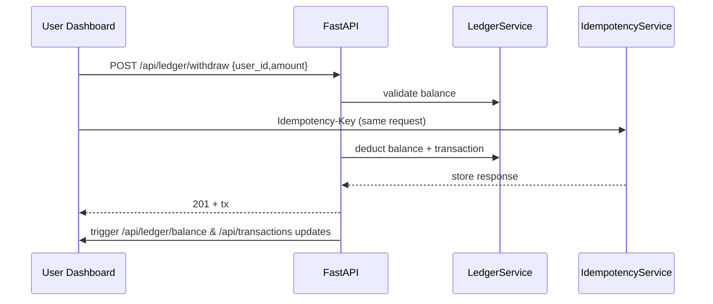

# Flow Diagram Outline

## Deposit Flow (Simulated Success)

```mermaid
sequenceDiagram
    participant UI as User Dashboard
    participant API as FastAPI
    participant Ledger as LedgerService
    participant Cache as IdempotencyService

    UI->>API: POST /api/ledger/deposit {payload}
    API->>Cache: Acquire key/idempotency check
    API->>Ledger: validate + credit balance
    Ledger-->>API: Commit transaction row
    Cache-->>API: Cache response
    API-->>UI: 201 + TransactionResponse
    API->>UI: trigger SWR mutate for balances/transactions
```

## Internal Transfer Flow

```mermaid
sequenceDiagram
    participant UI as User Dashboard
    participant API as FastAPI
    participant Ledger as LedgerService
    participant Cache as IdempotencyService

    UI->>API: POST /api/ledger/transfer {src_user,dst_user,amount}
    API->>Cache: Acquire key
    API->>Ledger: validate balance + debit source
    Ledger->>Ledger: credit destination (same tx)
    Ledger-->>API: TransactionResponse
    Cache-->>API: Cache response
    API-->>UI: 201 + tx
    API->>UI: refresh /api/transactions & /api/dashboard/admin
```

## Withdrawal Flow

```mermaid
sequenceDiagram
    participant UI as User Dashboard
    participant API as FastAPI
    participant Ledger as LedgerService
    participant Cache as IdempotencyService

    UI->>API: POST /api/ledger/withdraw {user_id,amount}
    API->>Ledger: validate balance
    UI->>Cache: Idempotency-Key (same request)
    API->>Ledger: deduct balance + transaction
    Cache-->>API: store response
    API-->>UI: 201 + tx
    API->>UI: trigger /api/ledger/balance & /api/transactions updates
```
